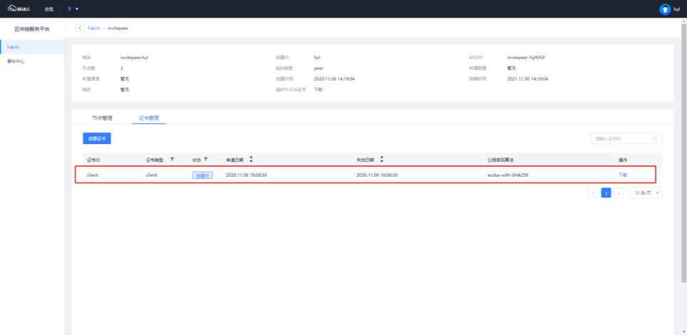
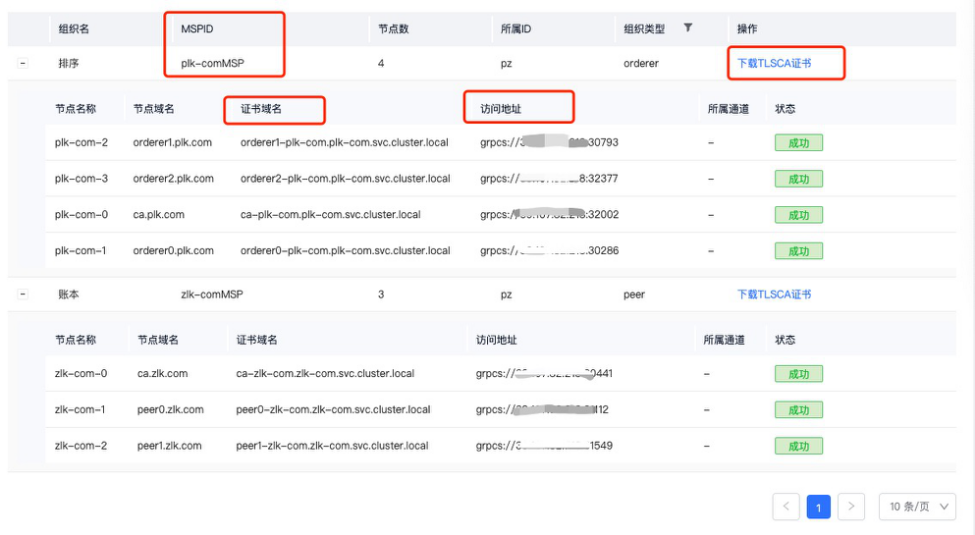

# Hyperledger Fabric Connector

该工具主要用于调试连接fabric网络，invoke/query 链码

## 预装软件

- Go 1.14+ installation or later

## 配置

配置默认存放在工具所在目录`conf`文件夹

### 1. 获取调用身份证书

下载的证书文件替换peerOrganizations/组织域名/users/证书ID@组织域名/msp/signcerts/证书ID@组织域名-cert.pem
下载的私钥文件替换peerOrganizations/组织域名/users/证书ID@组织域名/msp/keystore/下的sk文件，文件名必须使用下载的sk文件名

### 2. 获取组织的TLSCA证书，访问地址，节点域名，证书域名，MSPID

在联盟下组织管理页获取所需信息

### 1. 修改crypto-config下的目录
目录格式替换成
crypto-config
  --ordererOrganizations
    --排序组织域名 页面上排序组织域名
      --tlsca
        --tlsca.排序组织域名-cert.pem 下载的排序组织TLSCA证书
  --peerOrganizations
    --账本组织域名 页面上账本组织域名     
      --users
        --证书ID@账本组织域名
          --msp
            --keystore
              --证书标识符的私钥 下载的用户私钥
            --signcerts
              --证书ID@账本组织域名-cert.pem 下载的用户证书
            --tlscacerts
              --tlsca.账本组织域名-cert.pem 下载的账本组织TLSCA证书     
### 2.修改config.yaml
按照示例文件中注释做相应的替换

### 3.修改app.yaml
user：证书ID

### 调试命令

```
go build -o fabric-connector run/main.go
```

```shell
./fabric-connector chaincode invoke -C mychannel -n mycc -c '{"Args":["invoke","a","b","10"]}'
```

```shell
./fabric-connector chaincode query -C mychannel -n mycc -c '{"Args":["query","a"]}'
```

注意：`-p` 指定配置路径，默认路径是工具所在目录的`./conf`，可按实际路径改动
